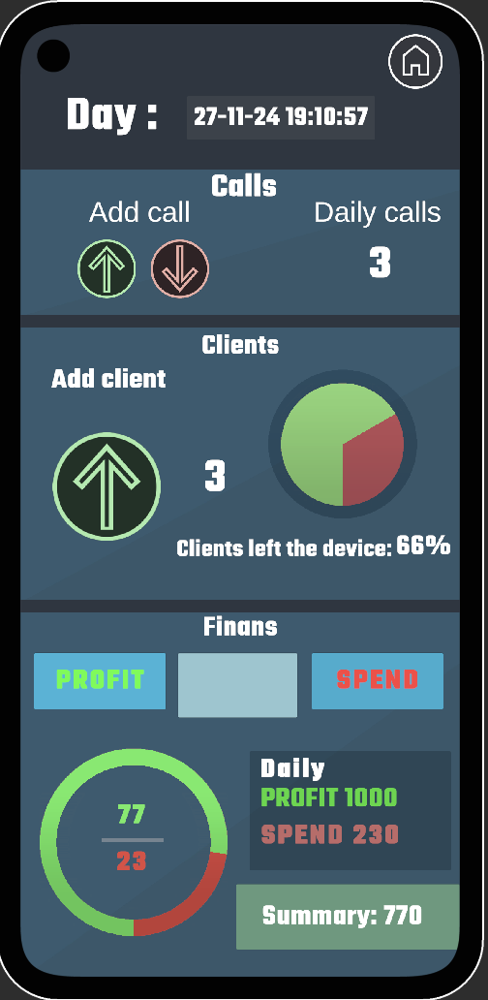
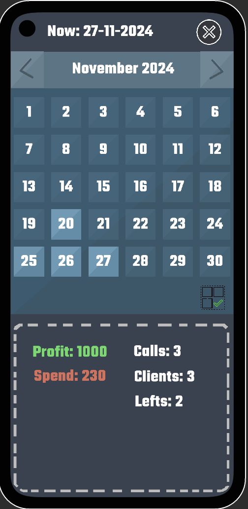

<h1>Daily Statistics Management App</h1>

This application is designed for service centers or small businesses to efficiently track daily statistics. It allows users to record the number of clients, calls, and financial transactions in real time, as well as calculate various statistics such as the percentage of clients who left devices for repair, the profit percentage in relation to expenses, and generate reports based on daily, monthly, or overall data.

<h2>🚀 Key Features:</h2>
<ul>
    <li><strong>Real-Time Data Entry</strong>  
        
Allows users to quickly input the number of clients, calls, and financial transactions (expenses and income).

    </li>
    <li><strong>Client Device Tracking</strong>  
        
Calculates the percentage of clients who left their devices in the workshop for repair.

    </li>
    <li><strong>Profit and Expense Calculations</strong>  
        
Calculates the percentage of profit in relation to expenses, giving insights into business performance.

    </li>
    <li><strong>Data Filtering</strong>  
        
Provides options to filter data by day, month, or full month for detailed reports.

    </li>
</ul>

<h2>🛠️ Technologies:</h2>
<ul>
    <li>Unity</li>
    <li>SQLite Database for Data Storage</li>
</ul>

<h2>🌟 Platform:</h2>

Android

<h2>🎯 Purpose:</h2>

This app is designed to help service centers or small businesses easily manage and track their daily statistics, making it ideal for quick decision-making and performance analysis.

### Screenshots

  
    

